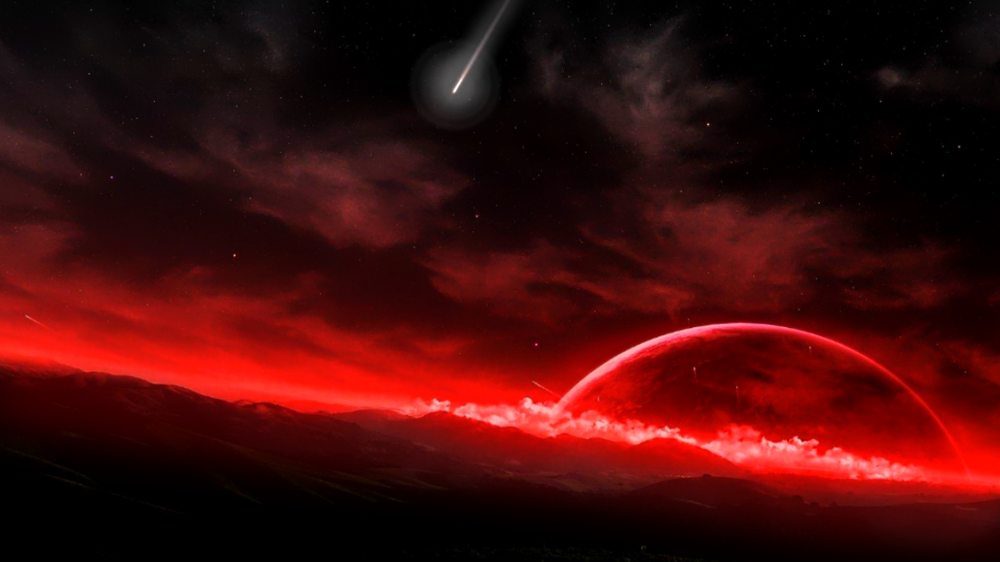
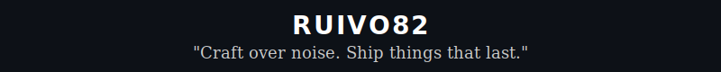
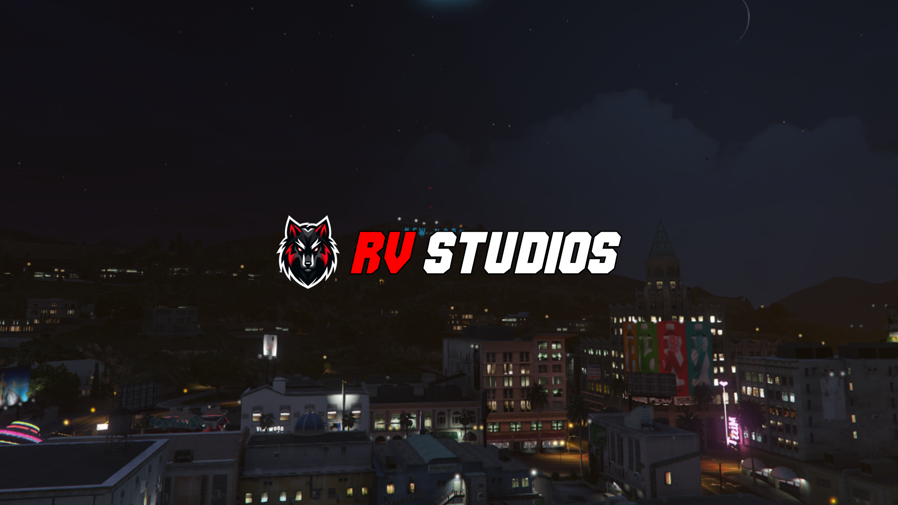
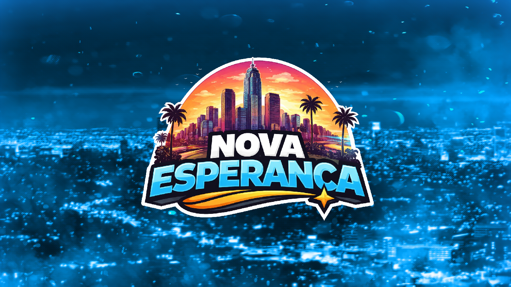

<div align="center">



</div>

---

<div align="center">



</div>

---

```python
class Ruivo82:
    name     = "Diogo Lopes"
    alias    = "Ruivo"
    location = "Portugal 🇵🇹"
    focus    = ["FiveM / Game Dev", "Full-Stack Web", "Systems & Backend"]
    stack    = ["C#", "Python", "JavaScript", "TypeScript", "React", "Lua"]
    db       = ["MySQL", "SQL Server", "SQLite"]
    tools    = ["Node.js", "Docker", "Git", "Vite", "Three.js"]
    building = "WebGL camera systems & FiveM experiences"
    motto    = "Craft over noise. Ship things that last."
```

---

<div align="center">

🛠 **Stack**


</div>

---

```
▸ Building  →  WebGL camera system for FiveM  (React 19 + Three.js + R3F)
▸ Working   →  FiveM scripts & server experiences
▸ Learning  →  Python automation & C# systems design
```

---

## 🛒 Store

<div align="center">


<a href="https://rv-studios.tebex.io/" target="_blank">
  
</a>


<br/>

**[→ rv-studios.tebex.io](https://rv-studios.tebex.io/)**

</div>

---

## 🔒 Current Project

<details>
<summary><b>🔒 "Something is coming..."</b></summary>

<br/>

<div align="center">



</div>

</details>

---

<div align="center">


</div>
