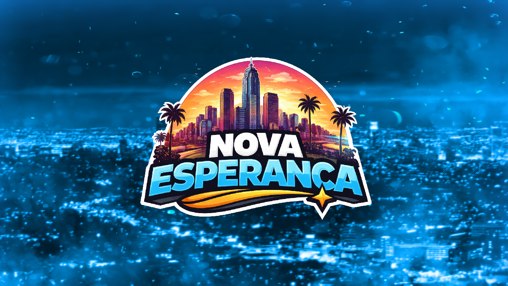

<div align="center">

# Ruivo

```py
class Ruivo82:
    dev = "Diogo Lopes"
    based = "Portugal"

    focus = ["FiveM", "Web", "Backend", "Frontend", "Database"]
    stack = ["TS", "React", "Lua", "C#", "Python", "JS"]

    building = "FiveM experiences"
```

```txt
▸ Building → WebGL systems
▸ Working  → FiveM experiences
▸ Learning → Python & C#
```

## 🛒 Store

<a href="https://rv-studios.tebex.io/" target="_blank">
  
</a>

### rv-studios.tebex.io

## 🔒 Current Project

> Something is coming...



</div>]
    stack = ["TS", "React", "Lua", "C#", "Python"]

    building = "WebGL & FiveM experiences"
```


```txt
▸ Building → WebGL systems
▸ Working  → FiveM experiences
▸ Learning → Python & C#
```

## 🛒 Store

<a href="https://rv-studios.tebex.io/" target="_blank">
  
</a>

### rv-studios.tebex.io

## 🔒 Current Project

> Something is coming...


</div>]
    stack = ["TS", "React", "Lua", "C#", "Python"]

    building = "WebGL & FiveM experiences"
```
```txt
▸ Building → WebGL systems
▸ Working  → FiveM experiences
▸ Learning → Python & C#
```

## 🛒 Store

<a href="https://rv-studios.tebex.io/" target="_blank">
  
</a>

### rv-studios.tebex.io

## 🔒 Current Project

> Something is coming...


</div>
